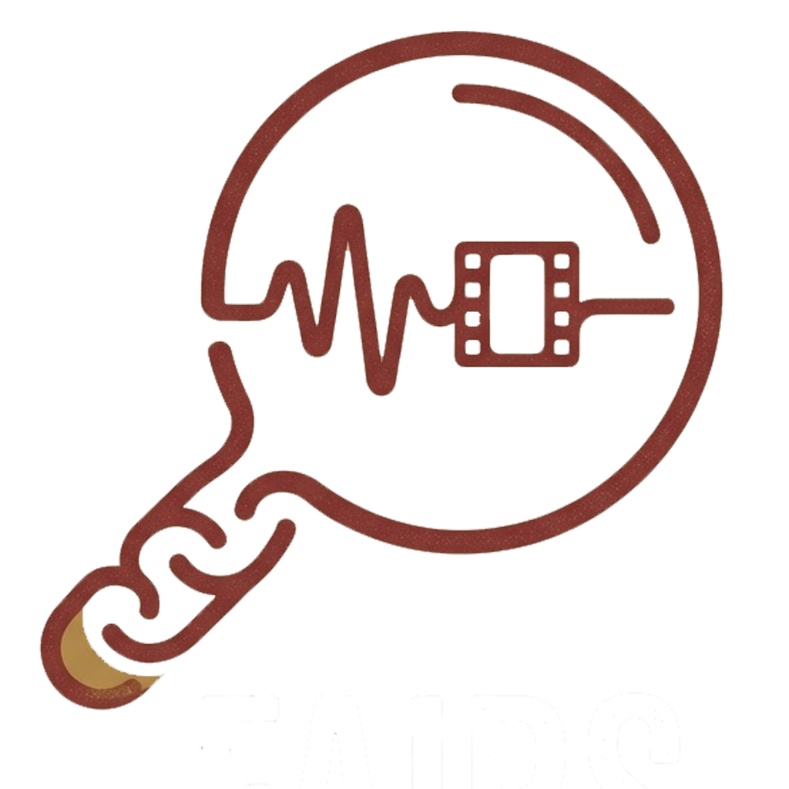

<!-- prettier-ignore-start -->

# FAIRS — Feel-Aware Information Retrieval System

**A neuroscience-inspired search engine that retrieves media by _how it feels_, not just what it's about.**

Built at [Bitcamp](https://bit.camp/) 2025 · University of Maryland

<!-- prettier-ignore-end -->

---

## Table of Contents

- [Project Overview \& Motivation](#project-overview--motivation)
- [Key Features](#key-features)
- [Tech Stack \& Architecture](#tech-stack--architecture)
- [Directory Structure](#directory-structure)
- [Prerequisites](#prerequisites)
- [Environment Variables](#environment-variables)
- [Installation \& Local Setup](#installation--local-setup)
- [How to Run](#how-to-run)
- [API Reference](#api-reference)
- [Known Limitations \& Future Roadmap](#known-limitations--future-roadmap)
- [Contributors](#contributors)
- [License](#license)

---

## Project Overview & Motivation

Traditional media search engines match on **keywords and metadata** — you type "sad piano music" and get results tagged with those words. But what if you could search by *the way content makes a human brain feel*?

**FAIRS (Feel-Aware Information Retrieval System)** is a dual-axis retrieval engine that combines:

1. **Content embeddings** — standard semantic similarity (what something is *about*).
2. **Neural embeddings** — brain-response vectors derived from fMRI-style cortical activation data (how something *feels*).

Users provide two inputs — an emotional "anchor" (the *feel*) and a topical reference (the *about*) — and FAIRS fuses both signals with a configurable scoring function to surface media that matches on both axes simultaneously. Results are accompanied by an interactive **3D brain visualization** (20,484-vertex cortical mesh) that lights up the specific regions driving each match.

This project was built in 24 hours at **Bitcamp**, the University of Maryland's annual hackathon.

---

## Key Features

- **Dual-input query engine** — select an emotional anchor and a topic reference, then retrieve media ranked by a weighted blend of content similarity, neural similarity, and diversity.
- **Configurable scoring weights** — tune lpha (content), eta (neural), and gamma (diversity) at query time to shift retrieval emphasis.
- **Interactive 3D brain visualization** — a real-time WebGL cortical surface mesh (powered by Three.js) that renders per-vertex neural activation heatmaps with a warm-to-hot colormap.
- **Region-level explainability** — the /explain endpoint breaks down neural similarity across 8 cortical parcellations (Visual Cortex, Auditory Cortex, Language Network, Default Mode Network, Attention Network, Motor Cortex, Salience Network, Association Cortex) and generates a human-readable summary.
- **Hover & click brain tooltips** — hovering over the 3D brain shows the cortical region name, local stimulation intensity, and a functional description; click to pin the tooltip.
- **Per-item activation maps** — view raw neural activation patterns for any item, normalized and overlaid on the cortical surface.
- **File upload support** — upload image, video, audio, or text files directly through the search bar.
- **Step-by-step guided UX** — a four-step wizard flow: *Choose Feel → Choose About → Find Matches → Explore Brain*.
- **Static corpus serving** — media assets (clips, thumbnails) served directly through FastAPI's static file mount.
- **SQLite metadata store** — a full relational schema for items, assets, embedding collections, processing runs, and demo queries with WAL journaling.

---

## Tech Stack & Architecture

### Languages & Frameworks

| Layer    | Technology                              |
| -------- | --------------------------------------- |
| Frontend | React 18, Vite 7, Tailwind CSS 3       |
| Backend  | Python 3.11+, FastAPI                   |
| Database | SQLite (WAL mode, foreign keys enabled) |
| 3D Viz   | Three.js r183, OrbitControls            |

### Libraries & Packages

| Package           | Role                                                  |
| ----------------- | ----------------------------------------------------- |
| 
umpy           | Cosine similarity, vertex-level activation math        |
| pydantic        | Request/response schema validation                     |
| uvicorn         | ASGI server for FastAPI                                |
| 	hree           | WebGL cortical mesh rendering                          |
| lucide-react    | Icon set (Brain, Upload, ExternalLink, etc.)           |
| 
eact / 
eact-dom | UI component library                               |

### High-Level Architecture

`
┌─────────────────────────────────────────────────────────────┐
│                        Browser                              │
│  ┌──────────────┐  ┌──────────────┐  ┌───────────────────┐  │
│  │  Search Bar   │  │ Result Cards │  │  3D Brain (Three) │  │
│  │  (CortexApp)  │  │  + Explain   │  │  BrainViz.jsx     │  │
│  └──────┬───────┘  └──────┬───────┘  └────────┬──────────┘  │
│         │                 │                    │             │
│         └────────┬────────┘────────────────────┘             │
│                  │  Vite dev proxy (:5173 → :8011)           │
└──────────────────┼──────────────────────────────────────────┘
                   │
        ┌──────────▼──────────┐
        │   FastAPI Backend   │
        │     (port 8011)     │
        ├─────────────────────┤
        │  /query             │──→ Dual-axis scoring
        │  /explain           │──→ Region-level breakdown
        │  /items             │──→ Item catalog
        │  /brain/parcellation│──→ Cortical region map
        │  /items/:id/activation│→ Per-vertex heatmap
        │  /corpus/*          │──→ Static media files
        └──────────┬──────────┘
                   │
    ┌──────────────┼──────────────┐
    │              │              │
┌───▼───┐   ┌─────▼─────┐  ┌────▼─────┐
│items  │   │ .npz files │  │ SQLite   │
│.json  │   │ (content,  │  │ fairs_   │
│       │   │  neural,   │  │ commons  │
│       │   │  raw)      │  │ .db      │
└───────┘   └───────────┘  └──────────┘
`

---

## Directory Structure

`
fairs-bitcamp/
├── backend/
│   ├── app/
│   │   ├── __init__.py          # Package marker
│   │   ├── config.py            # Settings dataclass (env-driven paths & weights)
│   │   ├── data_store.py        # In-memory item + embedding store, activation math
│   │   ├── main.py              # FastAPI app, routes, CORS, static mount
│   │   ├── schemas.py           # Pydantic models for all request/response types
│   │   ├── scoring.py           # Cosine similarity, diversity penalty, utilities
│   │   └── service.py           # Business logic: query, explain, health
│   └── storage/
│       ├── __init__.py          # Exports FairsDatabase, FairsRepository
│       ├── db.py                # SQLite schema DDL, connection wrapper
│       └── repository.py        # CRUD operations for items, embeddings, runs
├── frontend/
│   ├── public/
│   │   ├── brain_mesh.json      # 20,484-vertex cortical surface mesh (FreeSurfer)
│   │   ├── Fairs.png            # Project logo
│   │   ├── favicon.svg          # Browser tab icon
│   │   └── icons.svg            # SVG sprite sheet
│   ├── src/
│   │   ├── App.jsx              # Main application: search bar, results, explain panel
│   │   ├── App.css              # Component-level styles
│   │   ├── BrainViz.jsx         # Three.js cortical mesh with activation heatmap
│   │   ├── index.css            # Tailwind CSS directives
│   │   ├── main.jsx             # React DOM entry point
│   │   └── assets/              # Static images (hero, logos)
│   ├── fairs/                   # Landing page scaffold (separate Vite app)
│   │   ├── src/App.jsx          # Splash/getting-started page
│   │   └── package.json         # fairs-frontend dependencies
│   ├── index.html               # HTML shell
│   ├── package.json             # cortex-commons dependencies
│   ├── vite.config.js           # Dev proxy rules (→ backend :8011)
│   ├── tailwind.config.js       # Tailwind content paths
│   ├── postcss.config.js        # PostCSS plugins
│   └── eslint.config.js         # ESLint configuration
└── README.md                    # ← You are here
`

---

## Prerequisites

| Tool       | Version   | Purpose                            |
| ---------- | --------- | ---------------------------------- |
| Python     | ≥ 3.11    | Backend runtime                    |
| Node.js    | ≥ 18      | Frontend build toolchain           |
| npm        | ≥ 9       | Package management                 |
| Git        | any       | Version control                    |

---

## Environment Variables

All backend configuration is driven by environment variables with sensible defaults. No .env file is required for local development if data files are in the default locations.

| Variable                          | Description                                         | Default                                    |
| --------------------------------- | --------------------------------------------------- | ------------------------------------------ |
| FAIRS_ROOT_DIR                  | Project root directory                               | Auto-detected from config.py location    |
| FAIRS_DATA_DIR                  | Directory containing item manifests and embeddings   | <root>/data                              |
| FAIRS_CORPUS_DIR                | Directory for static media assets                    | <root>/corpus                            |
| FAIRS_ITEMS_PATH                | Path to items.json catalog                         | <root>/data/items.json                   |
| FAIRS_EMBEDDINGS_DIR            | Parent directory for embedding .npz files          | <root>/data/embeddings                   |
| FAIRS_CONTENT_EMBEDDINGS_PATH   | Content embedding vectors (.npz)                   | <root>/data/embeddings/content_embeddings.npz |
| FAIRS_NEURAL_EMBEDDINGS_PATH    | Pooled neural embedding vectors (.npz)             | <root>/data/embeddings/neural_embeddings_pooled.npz |
| FAIRS_RAW_NEURAL_EMBEDDINGS_PATH| Raw per-vertex neural activations (.npz)           | <root>/data/embeddings/neural_embeddings_raw.npz |
| FAIRS_PARCELLATION_PATH         | Brain region boundary definitions (.json)          | <root>/data/parcellation.json            |
| FAIRS_ALPHA                     | Default content similarity weight                    | .4                                      |
| FAIRS_BETA                      | Default neural similarity weight                     | .4                                      |
| FAIRS_GAMMA                     | Default diversity penalty weight                     | .2                                      |
| FAIRS_TOP_K                     | Default number of results returned                   | 6                                        |
| FAIRS_MAX_TOP_K                 | Maximum allowed 	op_k value                        | 12                                       |
| VITE_API_BASE_URL               | Frontend override for API base URL (optional)        | "" (uses Vite proxy)                     |

---

## Installation & Local Setup

### 1. Clone the repository

`ash
git clone https://github.com/a-typical-sheep/fairs-bitcamp.git
cd fairs-bitcamp
`

### 2. Set up the backend

`ash
# Create and activate a virtual environment
python -m venv .venv

# Windows
.venv\Scripts\activate

# macOS / Linux
source .venv/bin/activate

# Install Python dependencies
pip install fastapi uvicorn numpy pydantic
`

### 3. Prepare data files

Place the following files in the data/ directory at the project root:

`
data/
├── items.json                          # Item catalog (id, title, source, description, ...)
├── parcellation.json                   # Brain region vertex boundaries
└── embeddings/
    ├── content_embeddings.npz          # Content vectors (keyed by item id)
    ├── neural_embeddings_pooled.npz    # Pooled neural vectors (keyed by item id)
    └── neural_embeddings_raw.npz       # Raw per-vertex activations (keyed by item id)
`

### 4. Set up the frontend

`ash
cd frontend
npm install
`

---

## How to Run

### Start the backend (terminal 1)

`ash
# From the project root
uvicorn backend.app.main:app --host 127.0.0.1 --port 8011 --reload
`

### Start the frontend (terminal 2)

`ash
cd frontend
npm run dev
`

The Vite dev server starts on http://localhost:5173 and proxies API requests to the FastAPI backend on port 8011.

Open **http://localhost:5173** in your browser.

---

## API Reference

| Method | Endpoint                        | Description                                          |
| ------ | ------------------------------- | ---------------------------------------------------- |
| GET  | /health                       | System health check (item/embedding counts)          |
| GET  | /items                        | List all items in the catalog                        |
| GET  | /items/{item_id}              | Get a single item by ID                              |
| GET  | /items/{item_id}/activation   | Per-vertex neural activations for an item            |
| GET  | /brain/parcellation           | Cortical region boundaries and descriptions          |
| POST | /query                        | Dual-axis retrieval with content + neural scoring    |
| POST | /explain                      | Region-level neural similarity breakdown             |

### Query payload example

`json
{
  "input_a_id": "clip-melancholy-rain",
  "input_b_id": "clip-jazz-history",
  "top_k": 6,
  "alpha": 0.4,
  "beta": 0.4,
  "gamma": 0.2
}
`

---

## Known Limitations & Future Roadmap

### Current Limitations

- **Static dataset** — items and embeddings are loaded from flat files at startup; no live ingestion pipeline is exposed through the API.
- **Single-user** — no authentication or multi-tenant support.
- **No test suite** — the hackathon scope did not include automated tests.
- **Left-hemisphere only** — the brain mesh is a single-hemisphere FreeSurfer surface; full bilateral rendering is not yet implemented.
- **Hardcoded parcellation** — cortical regions use fixed vertex-count boundaries rather than atlas-aligned labels.

### Future Roadmap

- [ ] Live upload pipeline — embed new media on the fly via a background task queue.
- [ ] Bilateral brain rendering — display both hemispheres with atlas-aligned parcellation (Desikan–Killiany or HCP-MMP).
- [ ] User accounts & session history — persist search sessions and bookmarks.
- [ ] Streaming query results — return ranked results incrementally over WebSocket.
- [ ] Full-text search fallback — BM25 or hybrid retrieval when embeddings are unavailable.
- [ ] Docker Compose deployment — single-command spin-up with backend, frontend, and data volumes.
- [ ] Automated test suite — pytest for the backend, Vitest for the frontend.

---

## Contributors

| Name              | Role      |
| ----------------- | --------- |
| Harshil Vejendla  | Developer |

Built at **Bitcamp 2025** — University of Maryland's premier hackathon.

---

## License

This project is released under the [MIT License](LICENSE).
